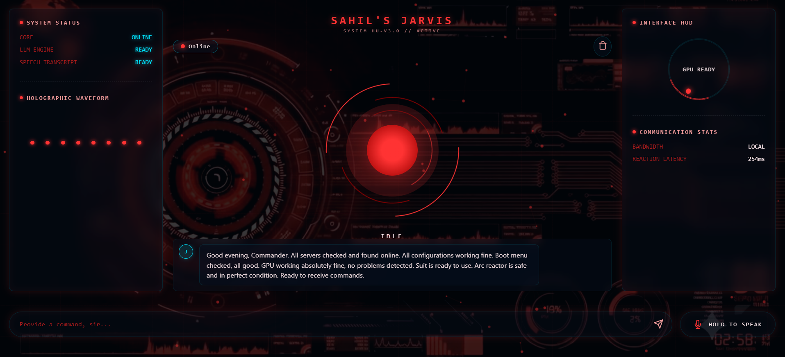
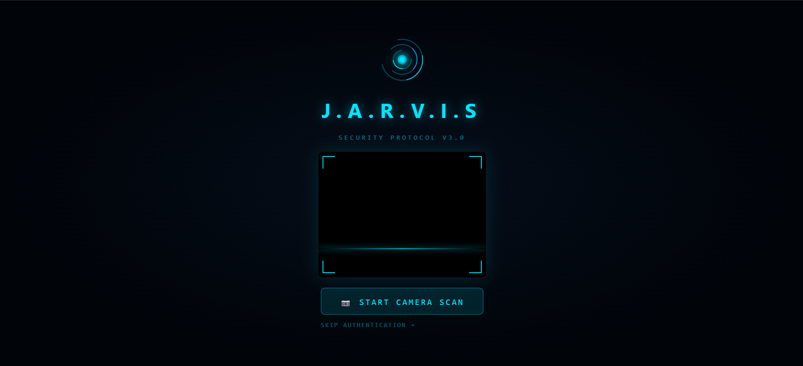

# 🤖 JARVIS — Local AI Voice Assistant

A fully local, GPU-accelerated AI assistant with a futuristic web HUD. Runs 100% offline on your personal workstation with zero cloud dependency.

[](docs/jarvis_detail.pdf)
[](#)
[](#)
[](#)
[](#)
[](#)

---

## 📸 Interface Preview

### 🛡️ Iron Man Holographic HUD & Real-Time Status


### 🖐️ Biometric Hand Authentication Screen


---

## 📑 Project Report & Architecture Whitepaper

The full 12-page comprehensive technical project report by Sahil is included directly in this repository:
📄 **[Download & Read Project Report (PDF)](docs/jarvis_detail.pdf)**

### Key Architecture Highlights:
- **100% Offline & Private**: Zero data leaves your machine; no external API calls.
- **Biometric Security**: Hand gesture detection via Google MediaPipe Hands model.
- **Zero-Latency Response**: Parallel text typing effect and Kokoro neural audio synthesis using `asyncio.gather()`.
- **Command Engine**: 50+ built-in system shortcuts for app launching, math, utilities, and diagnostics.
- **Background Startup**: Asynchronous model loading ensures port 8000 binds in <0.5s with non-blocking UI.

---

## ⚡ Quick Start (Windows One-Click Installer)

1. Clone or download this repository:
   ```powershell
   git clone https://github.com/sahildwivedi2010-cmyk/jarvis-assistant.git
   cd jarvis-assistant
   ```
2. Double-click **Install_JARVIS.bat** (or run as Administrator).
3. The installer will automatically check Python, install Ollama, pull Phi-4 Mini, install GPU PyTorch & dependencies, and create a Desktop shortcut!

---

## 🛠️ Manual Step-by-Step Setup Guide

### Step 1: Install Ollama (Your AI Brain)

1. Go to **https://ollama.com/download** and download the Windows installer
2. Run the installer and follow the prompts
3. Open **PowerShell** and pull the AI model:
   ```powershell
   ollama pull phi4-mini
   ```
   > This downloads a ~2.5GB model. Wait for it to finish.

4. Verify it works:
   ```powershell
   ollama run phi4-mini "Say hello"
   ```
   > You should see an AI response. Press Ctrl+D to exit.

---

### Step 2: Install espeak-ng (Required for Voice Output)

1. Go to **https://github.com/espeak-ng/espeak-ng/releases**
2. Download the latest `.msi` file (e.g., `espeak-ng-X.XX-x64.msi`)
3. Run the installer with **default settings**
4. **Important**: After installation, add espeak-ng to your PATH:
   - Open **Start Menu** → Search "Environment Variables"
   - Click **"Edit the system environment variables"**
   - Click **"Environment Variables"** button
   - Under "System variables", find `Path`, click **Edit**
   - Click **New** and add: `C:\Program Files\eSpeak NG`
   - Click **OK** on all dialogs
5. **Restart your PowerShell/terminal** after this

---

### Step 3: Set Up Python Environment

1. Open **PowerShell** and navigate to the project:
   ```powershell
   git clone https://github.com/sahildwivedi2010-cmyk/jarvis-assistant.git
   cd jarvis-assistant
   ```

2. Create a virtual environment:
   ```powershell
   python -m venv venv
   ```

3. Activate the virtual environment:
   ```powershell
   .\venv\Scripts\Activate.ps1
   ```
   > You should see `(venv)` at the start of your prompt.
   > 
   > **If you get a permissions error**, run this first:
   ```powershell
   > Set-ExecutionPolicy -ExecutionPolicy RemoteSigned -Scope CurrentUser
   > ```

4. Install dependencies:
   ```powershell
   pip install -r backend\requirements.txt
   ```
   > This will download and install all required Python packages.
   > **Note**: This may take a few minutes. `faster-whisper` and `kokoro` download AI models on first use.

---

### Step 4: Launch JARVIS! 🚀

1. **Make sure Ollama is running** (it usually starts automatically, but if not):
   ```powershell
   # In a separate terminal
   ollama serve
   ```

2. **Start the JARVIS server** (in your activated venv):
   ```powershell
   cd backend
   python main.py
   ```

3. You should see:
   ```
   ============================================================
     🤖 JARVIS — Local AI Voice Assistant
   ============================================================

   [STARTUP] Checking Ollama connection...
   [STARTUP] ✅ Ollama is running and model is ready!
   [STARTUP] Loading Speech-to-Text model...
   [STT] Model loaded successfully on CUDA!
   [STARTUP] Loading Text-to-Speech model...
   [TTS] Kokoro TTS loaded successfully!

   ============================================================
     🌐 Open http://localhost:8000 in your browser
   ============================================================
   ```

4. **Open your browser** and go to: **http://localhost:8000**

---

## 🎯 How to Use

### ⌨️ Text Mode
- Type your message in the input box
- Press **Enter** or click the **Send** button
- JARVIS will respond with text AND voice

### 🎤 Voice Mode
- **Hold** the microphone button and speak
- **Release** when done — JARVIS will:
  1. Transcribe your speech
  2. Think of a response
  3. Speak back to you

### 🧹 Clear Memory
- Click the **trash icon** in the top-right to reset the conversation

---

## 🔧 Troubleshooting

### "Ollama not available"
- Make sure Ollama is installed and running
- Try: `ollama serve` in a separate terminal
- Then: `ollama pull phi4-mini`

### "STT failed to load on CUDA"
- The system will automatically fall back to CPU mode
- For GPU: ensure NVIDIA drivers and CUDA toolkit are installed
- Check: `nvidia-smi` in terminal should show your GPU

### "Kokoro TTS failed to load"
- Make sure `espeak-ng` is installed and in your PATH
- Restart your terminal after installing espeak-ng
- Test: `espeak-ng "hello"` should produce speech

### "Cannot access microphone"
- Allow microphone access in your browser
- Use Chrome or Edge for best compatibility
- The site must be accessed via `localhost` (not an IP address) for mic to work

### Slow responses?
- The first response may be slow (model loading into VRAM)
- Subsequent responses should be much faster
- Check GPU usage: `nvidia-smi` — the model should be in GPU memory

---

## 📁 Project Structure

```
jarvis/
├── backend/
│   ├── main.py              # FastAPI server + WebSocket handler
│   ├── llm_engine.py        # Ollama LLM integration
│   ├── stt_engine.py        # faster-whisper speech-to-text
│   ├── tts_engine.py        # Kokoro TTS text-to-speech
│   └── requirements.txt     # Python dependencies
├── frontend/
│   ├── index.html           # JARVIS web UI
│   ├── style.css            # Futuristic dark theme
│   ├── app.js               # WebSocket client + audio logic
│   └── assets/
│       └── jarvis-logo.jpg  # JARVIS logo
└── README.md                # This file
```

---

## 🖥️ System Requirements

| Component | Minimum | Recommended |
|:---|:---|:---|
| GPU | NVIDIA GTX 1060 6GB | RTX 3050 6GB+ |
| RAM | 8 GB | 16 GB |
| Storage | 10 GB free | 20 GB free |
| Python | 3.10+ | 3.11+ |
| OS | Windows 10/11 | Windows 11 |

---

Made with 💙 — Your local AI, your rules.
